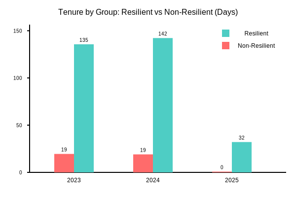
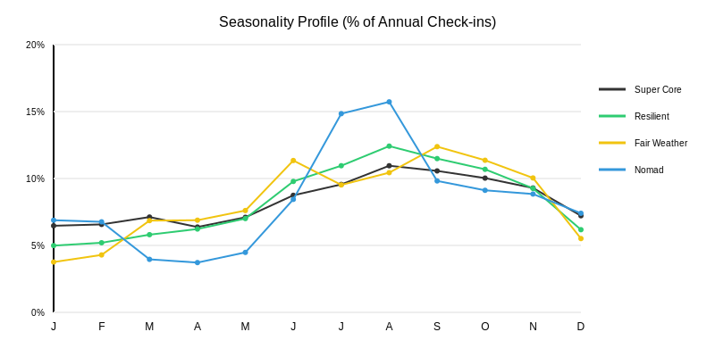
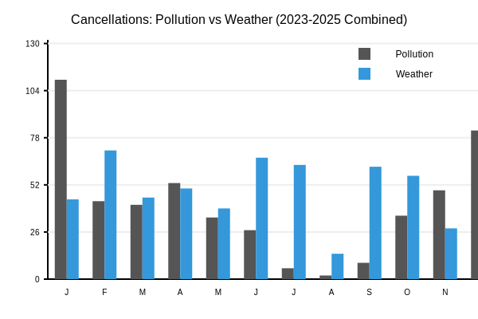

# Analyse H4 : Résilience Environnementale & Fidélité

**Date :** 7 Janvier 2026
**Période analysée :** 2023 - 2025
**Scope :** Shanghai

---

## 1. Synthèse Exécutive (Executive Summary)

L'analyse confirme que les conditions environnementales (pollution hivernale, chaleur estivale) agissent comme un puissant filtre comportemental.
*   **Conclusion Majeure :** La survie à l'hiver est le meilleur prédicteur de la fidélité long terme.
*   **Visualisation Clé :**

*Graph 1: Tenure moyenne (jours) des utilisateurs "Résilients" (bleu) vs "Non-Résilients" (rouge). L'écart est massif et constant.*

### 📝 Définitions & Données
Pour cette analyse, nous utilisons les définitions suivantes :
*   **Tenure (Ancienneté) :** Nombre de jours écoulés entre le premier et le dernier événement de l'utilisateur.
*   **Utilisateur Résilient :** Utilisateur ayant participé à **au moins un événement** durant un "mois extrême" (Janvier, Février, Juillet, Août, Décembre).
*   **Utilisateur Non-Résilient :** Utilisateur qui évite systématiquement ces périodes difficiles.

| Année | Tenure Moy. (Résilients) | Tenure Moy. (Non-Résilients) | Écart |
| :--- | :--- | :--- | :--- |
| **2023** | **135.6 jours** | 19.5 jours | **x7.0** |
| **2024** | **142.2 jours** | 19.0 jours | **x7.5** |
| **2025** | **32.1 jours** | 0.8 jours | **x40** |

---

## 2. Nouveaux Profils Utilisateurs (Clustering)

Nous avons identifié 4 personas distincts via le clustering comportemental.

### Saisonnalité par Profil

*Graph 2: Pourcentage de l'activité annuelle par mois pour chaque profil.*

1.  **Super Core (Noir) :** *Imperturbables.*
    *   **Stats :** Tenure ~740 jours | ~192 check-ins/an | Ratio Extrême 40%
    *   Activité constante même en Janvier/Février.

2.  **Regular Resilient (Vert) :** *Le cœur de la communauté.*
    *   **Stats :** Tenure ~530 jours | ~30 check-ins/an | Ratio Extrême 40%
    *   Légère baisse en hiver mais toujours présents.

3.  **Fair Weather Casuals (Jaune) :** *Les "beaux jours".*
    *   **Stats :** Tenure ~45 jours | ~3.5 check-ins/total | Ratio Extrême 5%
    *   Pic au printemps/automne, *flatline* en hiver.

4.  **Nomads (Bleu) :** *Le profil inversé.*
    *   **Stats :** Tenure ~42 jours | ~3.4 check-ins/total | Ratio Extrême **87%**
    *   Très actifs en Été et Hiver (vacances ?), absents le reste du temps.

---

## 3. L'Impact Environnemental

Pourquoi les utilisateurs occasionnels fuient-ils en Janvier et en Été ? Les données d'annulation confirment la cause.

*Graph 3: Nombre d'annulations explicitement liées à la Pollution (Gris) ou Météo/Chaleur (Bleu).*

*   **Hiver (Jan/Déc) :** La Pollution est la cause majeure de "Kill". C'est un filtre psychologique fort.
*   **Été (Juil/Août) :** La Chaleur/Météo cause des annulations, mais empêche moins la venue que la pollution (visible sur le graph de saisonnalité où l'été reste haut pour certains groupes).

---

## 4. Recommandations Stratégiques 2026 (Modèle Communautaire Gratuit)

Puisque FitFam est gratuit, l'objectif n'est pas le revenu mais **l'impact, la santé communautaire et le bénévolat**.

*   **Janvier / Février (Le Test de Loyauté) :** 
    *   *Objectif :* Consolider le "Noyau Dur" (Regular Resilient).
    *   *Action :* **Gamification "Winter Warrior"**. Lancez un défi de présence (ex: 8 séances en Janvier = T-shirt ou Badge Digital). C'est le moment de repérer les futurs **Leaders/Capitaines**.
    *   *Note :* Ne pas épuiser les Leaders à essayer de recruter des nouveaux à tout prix. Acceptez la baisse de volume, concentrez-vous sur la chaleur humaine des événements existants.
    
*   **Juillet / Août (L'Opportunité Nomade) :**
    *   *Objectif :* Engager les "Nomads" (Étudiants/Passagers) sans attendre de rétention longue.
    *   *Action :* Créez des rôles éphémères (ex: "Summer Captain"). Donnez-leur des responsabilités immédiates mais courtes. Ils dynamiseront les groupes pendant que les résidents sont en vacances.
    *   *Message :* "Restez en forme cet été, sans engagement."

*   **Septembre & Juin (La Grande Ouverture) :**
    *   *Objectif :* Maximiser l'impact et le recrutement de masse.
    *   *Action :* Grands événements sociaux et "Bring a Friend". C'est le moment où les *Fair Weather Casuals* sont receptifs. L'objectif est de les convertir en habitués avant l'hiver suivant.
    *   *Stratégie Bénévoles :* Profitez du volume pour identifier de nouveaux volontaires potentiels parmi la masse.
